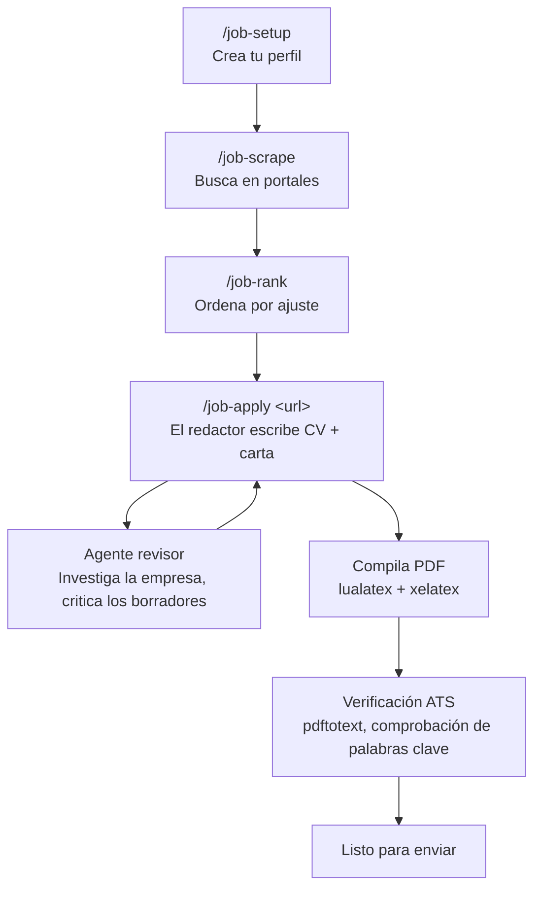

<p align="center">
  <a href="README.md">English</a>
</p>

<p align="center">
  
</p>

<h1 align="center">AI Job Search OpenCode</h1>

<p align="center">
  <em>La búsqueda de empleo que se ejecuta en <strong>tu</strong> máquina.</em>
</p>

<p align="center">
  <a href="LICENSE"></a>
  <a href="https://github.com/Iannpy/ai-job-search-opencode"></a>
  <a href="#"></a>
</p>

<p align="center">
  <strong>Haz un fork. Crea tu perfil. Deja que la IA se encargue del trabajo pesado.</strong><br />
  Evalúa ofertas, adapta tu CV, redacta cartas de presentación, prepárate para entrevistas — todo desde la terminal.
</p>

---

> **Fork comunitario** de [MadsLorentzen/ai-job-search](https://github.com/MadsLorentzen/ai-job-search) (22.9k estrellas), adaptado de Claude Code a OpenCode.
> Todo el crédito del framework original es para [Mads Lorentzen](https://github.com/MadsLorentzen).

---

## ¿Funciona de verdad?

El framework original lo construyó un geofísico que perdió su empleo a finales de 2025. Usó este mismo flujo de trabajo cada semana en su propia búsqueda:

> **69 postulaciones personalizadas → 20 primeras entrevistas → 1 contrato firmado.**

Comenzó como AI engineer en junio de 2026. El framework le consiguió el puesto. Ahora es tuyo.

[Lee la historia completa en LinkedIn](https://www.linkedin.com/in/mads-lorentzen/) · [Invítale un café](https://ko-fi.com/madslorentzen)

---

## Cómo funciona



**Tres agentes, un pipeline:**

| Agente | Rol |
|--------|-----|
| `job-assistant` | Orquestador — ejecuta comandos, redacta documentos, gestiona el estado |
| `job-reviewer` | Sub-agente con contexto independiente — investiga empresas, critica los borradores |
| `job-scraper` | Sub-agente — ejecuta los scrapers CLI en paralelo, deduplica resultados |

---

## Qué lo hace diferente

> **Separación redactor-revisor.** Dos agentes, dos contextos. El redactor escribe; un revisor con contexto independiente investiga la empresa y critica cada borrador. Nada de resultados genéricos de una sola pasada.

> **Verificación del PDF compilado.** LaTeX se ve bien en `.tex` y roto en el PDF. Este flujo compila con `lualatex` + `xelatex`, inspecciona cada página y corrige títulos huérfanos, fuentes inconsistentes y desbordes antes de que veas el archivo.

> **Verificación de palabras clave para ATS.** Los reclutadores no leen tu PDF — lo leen los parsers. `pdftotext` extrae la capa de texto y verifica datos de contacto, orden de lectura y cobertura de palabras clave contra la oferta. Las carencias reales quedan visibles, nunca se rellenan con contenido falso.

> **Recorte de CV por relevancia, no por antigüedad.** Cuando tu CV supera las 2 páginas, el sistema puntúa cada línea por su relevancia para el puesto — no elimina mecánicamente "lo más antiguo". Un punto de 2018 que coincide con las palabras clave de la oferta sobrevive frente a uno de 2023 que no lo hace.

---

## Inicio rápido

### 1. Haz un fork y clona

```bash
gh repo fork Iannpy/ai-job-search-opencode --clone
cd ai-job-search-opencode
```

### 2. Instala

**Windows:**
```powershell
.\install.ps1
```

**macOS / Linux:**
```bash
bash install.sh
```

El script copia comandos y skills a `~/.config/opencode/`, verifica tus dependencias y te muestra el bloque de agentes para agregar a `opencode.json`.

### 3. Crea tu perfil

```
/job-setup
```

Tres caminos: coloca archivos en `documents/` (CV PDF, exportación de LinkedIn, diplomas), pega un CV suelto o realiza la entrevista guiada. Cuanto más completo sea el material de entrada, mejores serán los resultados.

### 4. Busca

```
/job-scrape
```

Busca en LinkedIn + freehire.dev en paralelo. Deduplica entre ejecuciones. Ordenado por nivel de ajuste.

### 5. Postula

```
/job-apply https://example.com/oferta
```

O pega la descripción directamente. El pipeline redactor-revisor se ejecuta: evaluar ajuste → borrador de CV + carta → crítica del revisor → revisión → compilar PDF → verificar ATS.

---

## Comandos

| Comando | Qué hace |
|---------|----------|
| `/job-setup` | Crea tu perfil profesional (3 rutas de configuración inicial) |
| `/job-scrape` | Busca en LinkedIn + freehire.dev ofertas que coincidan |
| `/job-apply <url\|texto>` | Pipeline completo: evaluar → redactar → revisar → compilar → verificar |
| `/job-rank` | Puntúa en lote todas las ofertas encontradas, ranking ordenado |
| `/job-interview` | Paquete de preparación por etapa + entrevista simulada |
| `/job-outcome` | Registra el resultado, archiva materiales, actualiza el seguimiento |
| `/job-expand` | Analiza tu GitHub, Kaggle, Scholar — enriquece tu perfil |
| `/job-upskill` | Análisis de brechas: tus habilidades vs. ofertas → plan de aprendizaje |
| `/job-reset` | Elimina datos del perfil, documentos o ambos |

---

## Requisitos

| Herramienta | Para qué | Instalación |
|-------------|----------|-------------|
| [OpenCode](https://opencode.ai) | El entorno de ejecución del agente | `npm i -g opencode` |
| [Bun](https://bun.sh) | Ejecuta los scrapers CLI | `npm i -g bun` |
| Python 3.10+ | Comparativa salarial | [python.org](https://python.org) |
| LaTeX (lualatex + xelatex) | PDFs del CV y la carta | [MiKTeX](https://miktex.org) (Win) · [MacTeX](https://tug.org/mactex) (Mac) · [TeX Live](https://tug.org/texlive) (Linux) |
| poppler (`pdftotext`) | Verificación ATS de capa de texto *(opcional)* | `choco install poppler` (Win) · `brew install poppler` (Mac) · `apt install poppler-utils` (Linux) |

---

## Cobertura de mercado

| Scraper | Cobertura | Dependencia |
|---------|-----------|-------------|
| `linkedin-search` | Global — cualquier país mediante el flag `-l` | Bun (sin dependencias) |
| `freehire-search` | Empleos tech, multi-mercado, remoto | Bun (sin dependencias) |

> ¿Quieres tu portal local? Contribuye con un scraper CLI en `.agents/skills/` — sigue el patrón de `linkedin-search/` o `freehire-search/`.

---

## Estructura de archivos

```
ai-job-search-opencode/
├── AGENTS.md                          # Tu perfil (antes CLAUDE.md)
├── .opencode/
│   ├── commands/                      # 9 comandos slash
│   │   ├── job-setup.md               #   Configuración del perfil
│   │   ├── job-apply.md               #   Pipeline redactor-revisor
│   │   ├── job-scrape.md              #   Orquestación de búsqueda
│   │   ├── job-rank.md                #   Puntuación por lotes
│   │   ├── job-interview.md           #   Preparación de entrevistas
│   │   ├── job-outcome.md             #   Seguimiento de postulaciones
│   │   ├── job-expand.md              #   Enriquecimiento del perfil
│   │   ├── job-upskill.md             #   Análisis de brechas de habilidades
│   │   └── job-reset.md               #   Limpieza de datos
│   └── skills/
│       ├── job-search/                # Skill principal (8 archivos)
│       ├── job-scraper/               # Orquestación + consultas de búsqueda
│       └── job-tools/                 # Envoltorio de herramientas CLI Bun
├── .agents/skills/                    # Scrapers CLI de portales
│   ├── linkedin-search/               #   API pública de LinkedIn jobs
│   └── freehire-search/               #   API REST de freehire.dev
├── cv/                                # Plantillas LaTeX de CV (moderncv)
├── cover_letters/                     # Plantillas LaTeX de cartas (cover.cls)
├── documents/                         # Tus materiales de origen
├── templates/                         # Plantillas LaTeX personalizadas
├── tools/                             # salary_lookup.py, lint, seguridad
├── install.ps1 / install.sh           # Instaladores multi-plataforma
└── SETUP.md                           # Guía detallada de dependencias
```

---

## Consejos para mejores resultados

**La profundidad del perfil lo es todo.** Un perfil escaso produce postulaciones genéricas. Describe lo que *realmente hiciste* en cada puesto — proyectos concretos, herramientas, resultados medibles. Mejor material de entrada = mejor personalización.

**Usa las tres rutas de configuración.** Dirige `/job-setup` a tu carpeta `documents/` (CV, LinkedIn, diplomas, cartas de referencia) para obtener la mejor señal. Pega un CV para una importación rápida. El modo entrevista funciona desde cero.

**Deja que el revisor haga su trabajo.** El agente revisor comienza con un contexto independiente — detecta palabras clave omitidas, lenguaje genérico y enfoques débiles que el redactor pasó por alto. No lo omitas.

**Verifica los PDFs.** "En el .tex se ve bien" es la causa #1 de postulaciones defectuosas. El paso de compilar e inspeccionar es obligatorio por una razón.

---

## Contribuir

PRs bienvenidos. Buenas primeras tareas:

- **Adapta un portal de empleo** — sigue el patrón de `.agents/skills/linkedin-search/` y envía tu scraper local
- **Agrega una plantilla LaTeX** — coloca tu `.cls` + `.tex` en `templates/`
- **Mejora las consultas de búsqueda** — edita `.opencode/skills/job-scraper/search-queries.md` para tu mercado
- **Traduce** — los comandos y skills están en inglés; traducciones bienvenidas

---

## Diferencias con el original

| Original (Claude Code) | Este fork (OpenCode) |
|------------------------|---------------------|
| `CLAUDE.md` | `AGENTS.md` |
| `.claude/commands/` | `.opencode/commands/job-*.md` |
| `.claude/skills/` | `.opencode/skills/` |
| Portales daneses (4) | Portales globales (2) — linkedin + freehire |
| `/add-template`, `/add-portal` | Diferido a v2 |

---

## Licencia

MIT — la misma que el original. Ver [LICENSE](LICENSE).

## Agradecimientos

- [Mads Lorentzen](https://github.com/MadsLorentzen) — construyó el framework original [ai-job-search](https://github.com/MadsLorentzen/ai-job-search) y demostró que funciona consiguiendo empleo con él
- [Mikkel Krogholm](https://github.com/mikkelkrogsholm) — habilidades CLI de búsqueda de empleo
- Construido con [OpenCode](https://opencode.ai)
