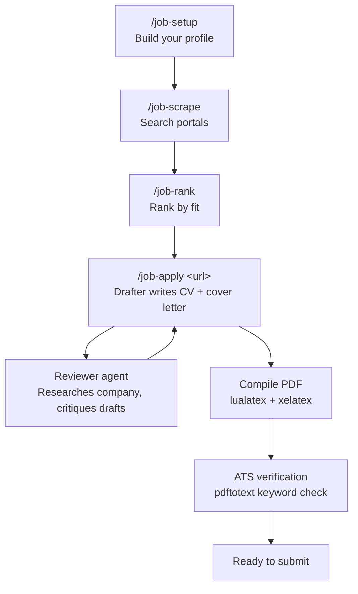

<p align="center">
  <a href="README.es.md">Español</a>
</p>

<p align="center">
  
</p>

<h1 align="center">AI Job Search OpenCode</h1>

<p align="center">
  <em>The job search that runs on <strong>your</strong> machine.</em>
</p>

<p align="center">
  <a href="LICENSE"></a>
  <a href="https://github.com/Iannpy/ai-job-search-opencode"></a>
  <a href="#"></a>
</p>

<p align="center">
  <strong>Fork it. Profile it. Let AI handle the grind.</strong><br />
  Evaluate postings, tailor your CV, write cover letters, prep interviews — all from your terminal.
</p>

---

> **Community fork** of [MadsLorentzen/ai-job-search](https://github.com/MadsLorentzen/ai-job-search) (22.9k stars), adapted from Claude Code to OpenCode.
> All credit for the original framework goes to [Mads Lorentzen](https://github.com/MadsLorentzen).

---

## Does it actually work?

The original framework was built by a geophysicist who got laid off in late 2025. He ran this exact workflow weekly on his own career:

> **69 tailored applications → 20 first interviews → 1 signed contract.**

He started as an AI engineer in June 2026. The framework got him hired. Now it's yours.

[Read the full story on LinkedIn](https://www.linkedin.com/in/mads-lorentzen/) · [Buy him a coffee](https://ko-fi.com/madslorentzen)

---

## How it works



**Three agents, one pipeline:**

| Agent | Role |
|-------|------|
| `job-assistant` | Orchestrator — runs commands, drafts documents, manages state |
| `job-reviewer` | Fresh-context sub-agent — researches companies, critiques your drafts |
| `job-scraper` | Sub-agent — runs Bun CLI scrapers in parallel, deduplicates results |

---

## What makes this different

> **Drafter-reviewer separation.** Two agents, two contexts. The drafter writes; a fresh reviewer agent researches the company and critiques every draft. No single-pass generic output.

> **PDF verification loop.** LaTeX looks fine in `.tex` and broken in the PDF. This workflow compiles with `lualatex` + `xelatex`, inspects every page, and fixes orphaned titles, font mismatches, and page overflows before you ever see the file.

> **ATS-aware keyword verification.** Recruiters don't read your PDF — parsers do. `pdftotext` extracts the text layer and verifies contact details, reading order, and keyword coverage against the posting. Gaps stay visible, never stuffed.

> **Relevance-weighted CV cutting.** When your CV overflows 2 pages, the system scores every line by relevance to the target posting — not mechanical oldest-first cutting. A 2018 bullet hitting the posting's keywords survives ahead of a 2023 bullet that doesn't.

---

## Quick start

### 1. Install OpenCode

```bash
npm i -g opencode
```

### 2. Fork & clone

```bash
gh repo fork Iannpy/ai-job-search-opencode --clone
cd ai-job-search-opencode
```

### 3. Run the installer

**Windows:**
```powershell
.\install.ps1
```

**macOS / Linux:**
```bash
bash install.sh
```

The script handles **everything**: installs Bun, Python, LaTeX, and poppler if missing, sets up scraper dependencies, copies commands and skills to your OpenCode config, and registers the agents. You only need to install OpenCode yourself.

### 4. Build your profile

```
/job-setup
```

Three paths: drop files in `documents/` (CV PDF, LinkedIn export, diplomas), paste a single CV, or walk through an interview. Richer input = sharper output.

### 5. Search

```
/job-scrape
```

Searches LinkedIn + freehire.dev in parallel. Deduplicates across runs. Sorted by fit.

### 6. Apply

```
/job-apply https://example.com/job-posting
```

Or paste the job description directly. The drafter-reviewer pipeline runs: evaluate fit → draft CV + cover letter → reviewer critique → revise → compile PDF → ATS verify.

---

## Commands

| Command | What it does |
|---------|-------------|
| `/job-setup` | Build your professional profile (3 onboarding paths) |
| `/job-scrape` | Search linkedin + freehire.dev for matching positions |
| `/job-apply <url\|text>` | Full pipeline: evaluate → draft → review → compile → verify |
| `/job-rank` | Batch-score all scraped postings, return ranked shortlist |
| `/job-interview` | Stage-specific prep pack + mock interview |
| `/job-outcome` | Log result, archive materials, update tracker |
| `/job-expand` | Scan your GitHub, Kaggle, Scholar — enrich your profile |
| `/job-upskill` | Gap analysis: your skills vs. tracked postings → learning plan |
| `/job-reset` | Wipe profile data, documents, or both |

---

## Prerequisites

| Tool | Why | Install |
|------|-----|---------|
| [OpenCode](https://opencode.ai) | The agent runtime | `npm i -g opencode` |
| [Bun](https://bun.sh) | Runs the job scraper CLIs | Handled by `install.ps1` |
| Python 3.10+ | Salary benchmarking | Handled by `install.ps1` |
| LaTeX (lualatex + xelatex) | CV and cover letter PDFs | Handled by `install.ps1` |
| poppler (`pdftotext`) | ATS text-layer verification *(optional)* | Handled by `install.ps1` |

> **Only OpenCode needs to be installed manually.** Run `.\install.ps1` (Windows) or `bash install.sh` (macOS/Linux) and it takes care of the rest.

---

## Market support

| Scraper | Coverage | Dependency |
|---------|----------|------------|
| `linkedin-search` | Global — any country via `-l` flag | Bun (zero runtime deps) |
| `freehire-search` | Tech jobs, multi-market, remote | Bun (zero runtime deps) |

> Want your local job board? Contribute a CLI scraper to `.agents/skills/` — follow the pattern in `linkedin-search/` or `freehire-search/`.

---

## File structure

```
ai-job-search-opencode/
├── AGENTS.md                          # Your candidate profile (was CLAUDE.md)
├── .opencode/
│   ├── commands/                      # 9 slash commands
│   │   ├── job-setup.md               #   Profile onboarding
│   │   ├── job-apply.md               #   Drafter-reviewer pipeline
│   │   ├── job-scrape.md              #   Job search orchestration
│   │   ├── job-rank.md                #   Batch fit-scoring
│   │   ├── job-interview.md           #   Interview prep
│   │   ├── job-outcome.md             #   Application tracking
│   │   ├── job-expand.md              #   Profile enrichment
│   │   ├── job-upskill.md             #   Skill gap analysis
│   │   └── job-reset.md               #   Data cleanup
│   └── skills/
│       ├── job-search/                # Core application skill (8 files)
│       ├── job-scraper/               # Search orchestration + queries
│       └── job-tools/                 # Bun CLI wrapper
├── .agents/skills/                    # Job portal CLI scrapers
│   ├── linkedin-search/               #   LinkedIn jobs-guest API
│   └── freehire-search/               #   freehire.dev REST API
├── cv/                                # LaTeX CV templates (moderncv)
├── cover_letters/                     # LaTeX cover letter templates (cover.cls)
├── documents/                         # Your source materials
├── templates/                         # Custom LaTeX templates
├── tools/                             # salary_lookup.py, lint, security
├── install.ps1 / install.sh           # Cross-platform installers
└── SETUP.md                           # Detailed dependency setup guide
```

---

## Tips for better results

**Profile depth is everything.** A thin profile produces generic applications. Describe what you *actually did* in each role — specific projects, tools, measurable outcomes. Richer input = sharper tailoring.

**Use the three onboarding paths.** Point `/job-setup` at your `documents/` folder (CV, LinkedIn export, diplomas, reference letters) for the strongest signal. Paste a CV for quick import. Interview mode works from scratch.

**Let the reviewer do its job.** The reviewer agent gets a fresh context — it catches missed keywords, weak framing, and generic language the drafter overlooked. Don't skip it.

**Verify the PDFs.** "Looks fine in the .tex" is the #1 cause of broken applications. The compile-and-inspect step is mandatory for a reason.

---

## Contributing

PRs welcome. Good first issues:

- **Port a job board** — follow the pattern in `.agents/skills/linkedin-search/` and submit your local portal scraper
- **Add a LaTeX template** — drop your `.cls` + `.tex` into `templates/`
- **Improve search queries** — edit `.opencode/skills/job-scraper/search-queries.md` for your market
- **Translate** — commands and skill files are in English; localizations welcome

---

## Differences from the original

| Original (Claude Code) | This fork (OpenCode) |
|------------------------|---------------------|
| `CLAUDE.md` | `AGENTS.md` |
| `.claude/commands/` | `.opencode/commands/job-*.md` |
| `.claude/skills/` | `.opencode/skills/` |
| Danish portals (4) | Global portals (2) — linkedin + freehire |
| `/add-template`, `/add-portal` | Deferred to v2 |

---

## License

MIT — same as the original. See [LICENSE](LICENSE).

## Acknowledgements

- [Mads Lorentzen](https://github.com/MadsLorentzen) — built the original [ai-job-search](https://github.com/MadsLorentzen/ai-job-search) framework and proved it works by getting hired with it
- [Mikkel Krogholm](https://github.com/mikkelkrogsholm) — job search CLI skills
- Built with [OpenCode](https://opencode.ai)
